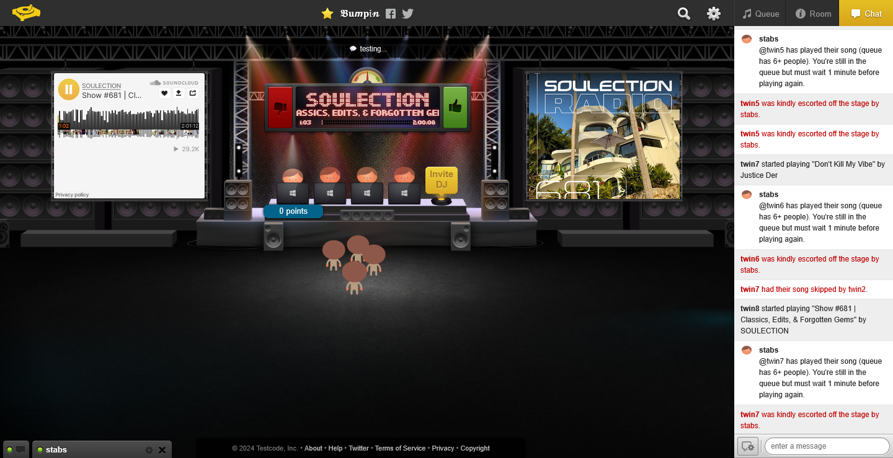

# DJ Queue Bot



*The DJ Queue Bot managing a live turntable.fm room with automatic queue enforcement and real-time notifications*

A sophisticated Turntable.fm bot for managing DJ queues in music rooms with automatic queue management, fair play enforcement, and real-time updates.

## 🎵 Overview

The DJ Queue Bot provides an automated queue management system for Turntable.fm rooms, designed to handle crowded rooms where many users want to DJ. It ensures everyone gets a fair chance to play music through intelligent queue management, dynamic rule enforcement, and comprehensive admin controls.

## ✨ Key Features

### 🎯 Smart Queue Management
- **Automatic DJ Detection**: Automatically adds users to the queue when they join the decks
- **Dynamic Rule Enforcement**: Switches between relaxed and strict modes based on queue size
- **Fair Play System**: Prevents users from monopolizing the decks when others are waiting
- **Persistent Queue**: Users remain in queue even when stepping down from decks

### ⚡ Real-Time Features
- **Event-Driven Updates**: Publishes queue status only when changes occur (no constant polling)
- **Song Tracking**: Broadcasts current song information with audience data for external integrations
- **Instant Notifications**: Real-time feedback for all queue operations
- **Auto-Sync**: Synchronizes with current DJ booth state
- **Bot Status Monitoring**: Discord integration includes bot health checks

### 🛡️ Advanced Controls
- **Admin Override System**: Comprehensive admin controls for queue management
- **Queue Locking**: Prevents unauthorized queue modifications
- **Wait Time Management**: 1-minute cooldown periods between DJ turns in strict mode
- **Graceful User Handling**: Manages user disconnections and refreshes intelligently

## 📋 Queue Rules & Behavior

### Dynamic Queue Modes

**Relaxed Mode** (< 6 users in queue):
- DJs can play multiple songs per turn
- No automatic removal from decks
- Flexible queue management

**Strict Mode** (6+ users in queue):
- Each DJ limited to **one song per turn**
- **1-minute cooldown** before rejoining decks
- Automatic enforcement to ensure fairness
- Users remain in queue during cooldown
- Private message notifications when cooldown expires

## 🎮 Commands Reference

### 👥 User Commands

| Command | Description |
|---------|-------------|
| `/q` | View the current DJ queue |
| `/a` | Add yourself to the DJ queue |
| `/r` | Remove yourself from the DJ queue (after current song) |
| `/queuestatus` | Show complete system status with wait times |
| `/usercommands` | Display all available user commands |

### 🔧 Admin Commands

| Command | Description |
|---------|-------------|
| `/enablequeue` | Enable the DJ queue system |
| `/disablequeue` | Disable the DJ queue system |
| `/lockqueue` | Toggle queue lock status |
| `/clearqueue` | Clear all entries from the queue |
| `/syncdjbooth` | Sync queue with current DJs |
| `/resetturns` | Reset all DJ wait times |
| `/shutdown` | Gracefully shutdown the bot |
| `/@a [username]` | Add specific user to queue |
| `/@r [username]` | Remove specific user from queue |
| `/admincommands` | Display admin command reference |

## 🚀 Installation & Setup

### Prerequisites

- Node.js (v14 or higher)
- Redis server or Redis cloud service
- Turntable.fm bot account

### Environment Variables

Create a `.env` file with the following variables:

```env
# Bot Configuration
DEEPCUT_BOT_AUTH=your_bot_auth_token
DEEPCUT_BOT_USERID=your_bot_user_id
DEEPCUT_BOT_ROOMID=target_room_id

# Redis Configuration (optional - set ENABLE_REDIS=true to use)
ENABLE_REDIS=true
UPSTASH_REDIS_AUTH=redis://your_redis_url

# Discord Configuration (optional)
DISCORD_TOKEN=your_discord_bot_token

# Admin Users (set at least one)
ADMIN_USERNAME_1=admin_username_1
ADMIN_USERNAME_2=admin_username_2
ADMIN_USERNAME_3=admin_username_3
```

### Installation Steps

1. **Clone and install dependencies:**
   ```bash
   npm install ttapi ioredis async-mutex discord.js
   ```

2. **Ensure required files:**
   - `queue.js` - Queue implementation class
   - `deepcutBot.js` - Main Turntable.fm bot file
   - `discordBot.js` - Discord integration bot (optional)
   - `.env` - Environment configuration

3. **Start the bots:**
   ```bash
   # Start the main Turntable.fm bot
   node deepcutBot.js
   
   # Start the Discord bot (in separate terminal, if Redis enabled)
   node discordBot.js
   ```

## 🔌 Redis Integration & Discord Bot

The bot provides real-time data through Redis channels for external integrations and includes a companion Discord bot for enhanced functionality.

### Redis Channels

#### Channel 1: Queue Status (`channel-1`)
```json
{
  "DJs": "username1, username2, username3",
  "locked": false
}
```

#### Channel 2: Song Information (`channel-2`)
```json
{
  "songName": "Song Title",
  "artist": "Artist Name", 
  "djName": "DJ Username",
  "startTime": 1683842567890,
  "roomName": "Room Name",
  "audience": ["listener1", "listener2"],
  "djsOnDecks": ["dj1", "dj2", "dj3"]
}
```

### Discord Bot Features

**🎵 Live Music Status:**
- Real-time display of currently playing tracks
- Current DJ and all DJs on decks information
- Live queue status with accurate counts
- Room audience list with member counts
- Bot health monitoring with online/offline status

**📅 Event Management:**
- Monthly DJ event scheduling system
- Timezone-aware slot booking
- Automated conflict prevention

#### Discord Commands

| Command | Description |
|---------|-------------|
| `!playing` | Show currently playing track, DJs, queue, and audience |
| `!djtimes` | Display next event DJ schedule |
| `!djtimes YYYY MM` | Show specific month's event schedule |
| `!signup <slot> <timezone>` | Sign up for an event DJ slot |
| `!events` | List next 6 upcoming events |

## 🏗️ Architecture & Design

### Key Features
- **Mutex-based concurrency control** prevents race conditions
- **Event-driven architecture** for real-time updates
- **Separate Redis connections** for publish/subscribe operations
- **Smart user lifecycle management** with refresh detection
- **Dynamic rule enforcement** based on queue size

### Configuration Constants

```javascript
const QUEUE_SIZE_THRESHOLD = 6;      // When strict mode activates
const QUEUE_FULL_SIZE = 5;           // "Full queue" announcement
const DJ_WAIT_TIME = 60000;          // 1-minute cooldown (ms)
const REFRESH_GRACE_PERIOD = 30000;  // 30-second rejoin window
```

## 🐛 Troubleshooting

### Common Issues

**Commands not working:**
- Verify exact command format (case-sensitive)
- Check bot has speaking privileges in room
- Ensure queue system is enabled for user commands

**Admin commands failing:**
- Confirm username matches environment variables exactly
- Check bot has moderator privileges for user removal

**Queue state inconsistencies:**
- Use `/syncdjbooth` to resync with room state
- Check Redis connection for live updates

**Discord bot showing "No one in audience":**
- Fixed in latest version with enhanced `newsong` handler
- Restart both bots if issue persists

### Debug Mode
Enable verbose logging by setting:
```bash
DEBUG=true node deepcutBot.js
```

## 🔒 Security & Performance

- **Admin Authentication**: Username-based admin verification
- **Command Validation**: Input sanitization and validation
- **Rate Limiting**: Built-in cooldowns prevent spam
- **Event-driven publishing**: Reduces network overhead
- **Graceful shutdown**: Clean termination on system signals

## 📄 License

This project is licensed under the GNU General Public License v3.0 - see the LICENSE file for details.

---

**Made with 🎵 for the Turntable.fm community**